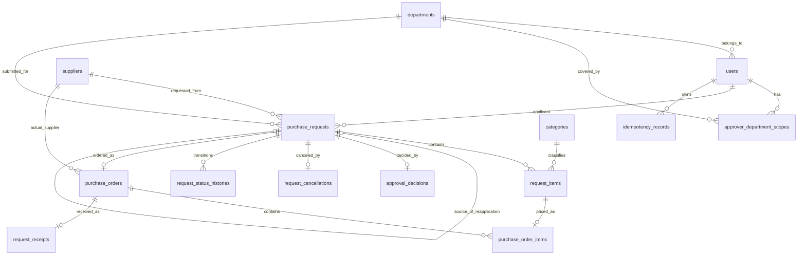

# DB設計

最終更新: 2026-09-25

## 1. 目的と設計段階

本書は、社内購買・申請ワークフロー管理システムのMVPで使用するPostgreSQLの論理Schema、主要制約、Transaction境界、Index方針を定義する。

業務上の不変条件と責務分担を先に決め、実際のDDL、Migration Tool、Indexの最終構成はSpring Boot実装と `EXPLAIN ANALYZE` による計測を通じて確定する。

## 2. 基本方針

- 主キーはPostgreSQLの `UUID` 型で統一する
- 人が使用する申請番号はUUIDと分け、正式提出時に採番する
- Entity、API Request DTO、Response DTOを直接共用しない
- `purchase_requests` を申請AggregateのRootとする
- 楽観ロック用 `version` は `purchase_requests` だけに持たせる
- 正式提出後の申請内容と明細は変更不可とする
- 現在状態とappend-onlyの状態履歴を分ける
- 業務操作と対応する履歴・判断記録は同一Transactionで保存する
- 正規化を基本とし、時点情報を残す監査Snapshotだけを意図的に保存する
- MasterとUserは物理削除せず、`active` で無効化する
- 物理削除できるのは本人所有の `DRAFT` だけとする

## 3. ER概要



## 4. IDと申請番号

### UUID

全テーブルの主キーをUUIDとする。Dynamic Route、API、外部キーでも同じIDを使用する。UUIDが推測しにくいことを認可の代わりにはせず、Spring Bootで所有者、Role、担当部門、状態を必ず検証する。

### 申請番号

`purchase_requests.request_number` は `DRAFT` 中は `NULL` とし、`DRAFT → SUBMITTED` の提出成功時に採番する。

```text
DRAFT       id = UUID / request_number = NULL
SUBMITTED   id = 同じUUID / request_number = REQ-2026-000001
```

- 年は提出日時を日本時間へ変換して決定する
- 番号部分はPostgreSQLのGlobal Sequenceを使用する
- 年をまたいでも番号部分をリセットしない
- `request_number` に一意制約を付ける
- Rollback等による欠番を許容する
- 申請番号は件数ではなく、人向けの問い合わせ識別子として扱う

## 5. 共通Data Type

### 日時

操作が起きた瞬間は `timestamptz` とし、Spring Bootでは `Instant` を基本に扱う。画面表示時に `Asia/Tokyo` へ変換する。

```text
created_at
updated_at
submitted_at
decided_at
ordered_at
completed_at
changed_at
```

時刻を持たない業務上の日付は `DATE` とする。

```text
desired_delivery_date
promised_delivery_date
received_date
```

### 金額と数量

- 日本円の税込整数だけを扱う
- 予定単価・実単価は `BIGINT`
- 数量と行番号は `INTEGER`
- PostgreSQL固有の `MONEY` は使用しない
- 合計金額、差額、超過率は重複保存せず、明細からSpring Bootが計算する

### Status

Statusは `VARCHAR(32)` とCHECK制約を使用する。

```text
DRAFT
SUBMITTED
CANCELED
REJECTED
APPROVED
ORDERED
COMPLETED
REAPPLICATION_REQUIRED
```

Java側ではEnumとして扱う。CHECK制約は許可値だけを保証し、状態遷移の妥当性はSpring Bootが検証する。

## 6. Master・User・承認範囲

### departments

```text
id              UUID PK
code            VARCHAR UNIQUE NOT NULL
name            VARCHAR NOT NULL
active          BOOLEAN NOT NULL
created_at      timestamptz NOT NULL
updated_at      timestamptz NOT NULL
```

MVPでは汎用的な部門階層を扱わない。

### users

```text
id                 UUID PK
employee_number    VARCHAR UNIQUE NOT NULL
cognito_sub        VARCHAR UNIQUE NOT NULL
display_name       VARCHAR NOT NULL
department_id      UUID FK -> departments NOT NULL
active             BOOLEAN NOT NULL
created_at         timestamptz NOT NULL
updated_at         timestamptz NOT NULL
```

- 外部キーでは内部の `users.id` を使用する
- `id` と社員番号は再利用しない
- 改姓時は現在の `display_name` へ更新する
- Userは物理削除しない
- RoleはCognito Groupを正とし、User Role Tableは作らない

### approver_department_scopes

```text
user_id          UUID FK -> users
department_id    UUID FK -> departments
created_at       timestamptz NOT NULL
PK (user_id, department_id)
```

承認候補者を申請ごとに事前作成せず、承認操作時点のCognito Roleと本Tableの担当範囲で承認可否を判断する。

### suppliers

```text
id              UUID PK
code            VARCHAR UNIQUE NOT NULL
name            VARCHAR NOT NULL
active          BOOLEAN NOT NULL
created_at      timestamptz NOT NULL
updated_at      timestamptz NOT NULL
```

### categories

```text
id              UUID PK
code            VARCHAR UNIQUE NOT NULL
name            VARCHAR NOT NULL
active          BOOLEAN NOT NULL
created_at      timestamptz NOT NULL
updated_at      timestamptz NOT NULL
```

仕入先とカテゴリは物理削除せず、無効化後も過去データから参照可能にする。

## 7. 申請

### purchase_requests

```text
id                                  UUID PK
request_number                      VARCHAR UNIQUE NULL
source_request_id                   UUID FK -> purchase_requests NULL
applicant_id                        UUID FK -> users NOT NULL
created_by                          UUID FK -> users NOT NULL
submitted_by                        UUID FK -> users NULL
department_id                       UUID FK -> departments NOT NULL
department_name_snapshot            VARCHAR NULL
requested_supplier_id               UUID FK -> suppliers NULL
requested_supplier_name_snapshot    VARCHAR NULL
title                               VARCHAR(100) NULL
reason                              VARCHAR(1000) NULL
desired_delivery_date               DATE NULL
note                                VARCHAR(1000) NULL
status                              VARCHAR(32) NOT NULL
version                             BIGINT NOT NULL
submitted_at                        timestamptz NULL
created_at                          timestamptz NOT NULL
updated_at                          timestamptz NOT NULL
```

下書きでは未完成項目を許可するため、一部のColumnをNULL可とする。提出処理で必須項目をSpring Bootが検証する。

申請部門はUserが入力しない。下書き作成時は認証Userの現在部門を設定し、正式提出時に再取得して `department_id` と `department_name_snapshot` を確定する。

希望仕入先名は提出時にMasterから `requested_supplier_name_snapshot` へ保存し、以降変更しない。

### 再申請案

`source_request_id` は、金額超過した元申請を参照する自己参照外部キーとする。

- 通常申請では `NULL`
- 自分自身は参照不可
- 元申請は `REAPPLICATION_REQUIRED`
- `source_request_id` に一意制約を付ける
- 再申請案の `applicant_id` は元申請者
- `created_by` は案を作成した購買担当者
- `submitted_by` は元申請者が提出するまで `NULL`
- 汎用的な代理申請は許可しない

再申請案が `DRAFT` のまま物理削除された場合は、一意制約の対象行がなくなるため再作成できる。

### request_items

```text
id                    UUID PK
request_id            UUID FK -> purchase_requests NOT NULL
line_number            INTEGER NOT NULL
product_name           VARCHAR(200) NULL
model_number           VARCHAR(100) NULL
product_url            VARCHAR(2048) NULL
category_id            UUID FK -> categories NULL
quantity               INTEGER NULL
planned_unit_price     BIGINT NULL
created_at             timestamptz NOT NULL
updated_at             timestamptz NOT NULL

UNIQUE (request_id, line_number)
CHECK (line_number BETWEEN 1 AND 20)
```

- `purchase_requests 1 : N request_items`
- Userは `line_number` を入力せず、Request配列順からSpring Bootが採番する
- 取得時は `ORDER BY line_number ASC`
- 下書き更新は既存明細を削除し、送信された全明細を同一Transactionで再作成する
- 保存ごとに明細UUIDが変わることを許容する
- 提出後は明細と `line_number` を変更しない
- 数量・単価は値がある場合の範囲CHECKを設け、提出時の必須性はSpring Bootで検証する

### 下書きの履歴

下書きの作成・編集・削除について、Revision Tableと状態履歴を作らない。`created_at` と `updated_at` だけを記録する。

## 8. 承認・取消・状態履歴

### approval_decisions

```text
id             UUID PK
request_id     UUID FK -> purchase_requests UNIQUE NOT NULL
decision       VARCHAR(16) NOT NULL
decided_by     UUID FK -> users NOT NULL
comment        VARCHAR(500) NULL
decided_at     timestamptz NOT NULL
```

- 申請提出時に承認候補者の行を作らない
- 実際に承認・却下した時点で1件だけ作成する
- `decision` は `APPROVED` または `REJECTED`
- 承認コメントは任意
- 却下理由は必須で、NULL・空白だけをDBのCHECK制約でも拒否する
- 過去の判断を更新・削除しない

### request_cancellations

```text
id               UUID PK
request_id       UUID FK -> purchase_requests UNIQUE NOT NULL
canceled_by      UUID FK -> users NOT NULL
cancel_reason    VARCHAR(500) NOT NULL
canceled_at      timestamptz NOT NULL
```

- 申請者本人が `SUBMITTED` の申請を取り消した場合だけ作成する
- 取消理由はNULL・空白だけをDBのCHECK制約でも拒否する
- 取消記録を更新・削除しない

### request_status_histories

```text
id                 UUID PK
request_id         UUID FK -> purchase_requests NOT NULL
from_status        VARCHAR(32) NOT NULL
to_status          VARCHAR(32) NOT NULL
request_version    BIGINT NOT NULL
changed_by         UUID FK -> users NOT NULL
actor_role         VARCHAR(16) NOT NULL
changed_at         timestamptz NOT NULL

UNIQUE (request_id, request_version)
```

- `purchase_requests.status` は現在状態の検索に使用する
- 本Tableは状態遷移の順序、操作者、操作時Roleを記録する
- 履歴はappend-onlyとし、更新・削除しない
- 状態が変わる場合だけ追加し、下書き保存では追加しない
- `request_version` は状態更新後のversion
- versionに欠番があっても問題ない
- 表示順は `request_version ASC`
- 却下理由や取消理由等を重複保存しない
- `actor_role` はSpring Bootが操作と認証情報から決定する

## 9. 発注・受領

### purchase_orders

```text
id                               UUID PK
request_id                       UUID FK -> purchase_requests UNIQUE NOT NULL
actual_supplier_id               UUID FK -> suppliers NOT NULL
actual_supplier_name_snapshot    VARCHAR NOT NULL
purchase_order_number            VARCHAR(100) NOT NULL
promised_delivery_date           DATE NOT NULL
purchaser_note                   VARCHAR(1000) NULL
ordered_by                       UUID FK -> users NOT NULL
ordered_at                       timestamptz NOT NULL
```

- 1申請1発注とする
- 実仕入先名は発注時にMasterからSnapshotする
- 商品と数量は申請明細を正とし、発注側で変更しない
- 実発注合計、承認額との差額、超過率は保存せず、明細から計算する

### purchase_order_items

```text
id                   UUID PK
purchase_order_id    UUID FK -> purchase_orders NOT NULL
request_item_id      UUID FK -> request_items NOT NULL
actual_unit_price    BIGINT NOT NULL

UNIQUE (request_item_id)
```

- 申請明細と発注明細を1対0..1で対応付ける
- `request_item_id` の一意制約で、同じ申請明細の重複発注を防ぐ
- 発注する全申請明細に対応する発注明細が1件ずつあることをSpring Bootで検証する
- 別申請の `request_item_id` が混入しないことをSpring Bootで検証する
- 元の申請明細から商品名・数量を取得し、実単価だけを保存する

### request_receipts

```text
id                   UUID PK
purchase_order_id    UUID FK -> purchase_orders UNIQUE NOT NULL
received_date        DATE NOT NULL
receipt_note         VARCHAR(1000) NULL
received_by          UUID FK -> users NOT NULL
completed_at         timestamptz NOT NULL
```

- 1発注1回の一括受領とする
- 部分受領は扱わない
- 受領日が発注日より前でないこと、未来日でないことはSpring Bootで検証する
- 発注と受領は別の業務操作であるため、別Tableへ分ける

## 10. Idempotency

### idempotency_records

```text
id                    UUID PK
user_id               UUID FK -> users NOT NULL
operation_type        VARCHAR NOT NULL
idempotency_key       VARCHAR NOT NULL
request_hash          VARCHAR NOT NULL
processing_status     VARCHAR NOT NULL
resource_id           UUID NULL
response_status       INTEGER NULL
response_body         JSONB NULL
created_at            timestamptz NOT NULL
expires_at            timestamptz NOT NULL

UNIQUE (user_id, operation_type, idempotency_key)
```

- 同じUser・操作・Key・Request Hashでは保存済みResponseを返す
- 同じUser・操作・Keyで異なるRequest Hashの場合は409
- `request_hash` はHTTP Method、対象Resource ID、正規化したBody等から計算する
- Timeout後の同一操作は同じKeyで再試行する
- MVPでは少なくとも申請提出で使用する
- 初回下書き作成へ適用するかは、重複下書きRiskと作業時間を見て決める

処理中の同時Retry、500系Responseの保存、保存期間、Cleanup方法は実装直前に決定する。

## 11. Transaction境界

### 下書き更新

1. 本人所有、`DRAFT`、version一致を確認する
2. `purchase_requests` の編集可能項目とversionを更新する
3. 既存 `request_items` を削除する
4. 新しい明細を配列順に再作成する
5. いずれかに失敗した場合はすべてRollbackする

### 提出

1. version、所有者、状態、必須項目、Master有効性を確認する
2. 部門・希望仕入先Snapshotを確定する
3. 申請番号を採番する
4. `purchase_requests` を `SUBMITTED` へ更新する
5. `request_status_histories` を追加する
6. Idempotency結果を保存する

### 承認・却下

1. Role、担当部門、自己承認禁止、状態、versionを確認する
2. `purchase_requests` の状態とversionを更新する
3. `approval_decisions` を追加する
4. `request_status_histories` を追加する

### 取消

1. 本人、`SUBMITTED`、versionを確認する
2. `purchase_requests` を `CANCELED` へ更新する
3. `request_cancellations` を追加する
4. `request_status_histories` を追加する

### 発注

1. Role、`APPROVED`、version、実仕入先、発注明細を確認する
2. 承認額と実発注額、超過条件を再計算する
3. `purchase_orders` と `purchase_order_items` を追加する
4. `purchase_requests` を `ORDERED` へ更新する
5. `request_status_histories` を追加する

### 受領完了

1. Role、`ORDERED`、version、受領日を確認する
2. `request_receipts` を追加する
3. `purchase_requests` を `COMPLETED` へ更新する
4. `request_status_histories` を追加する

## 12. 外部キー削除方針

- `purchase_requests -> request_items` は `ON DELETE CASCADE`
- 発注明細から申請明細への参照は `ON DELETE RESTRICT`
- 提出後に作られる承認、取消、発注、受領、履歴は `ON DELETE RESTRICT`
- User、部門、仕入先、カテゴリは物理削除せず `active = false`
- 下書き削除時だけ、申請本体と明細を物理削除する

## 13. Index方針

Primary KeyとUnique制約では一意なB-tree Indexが作られる。PostgreSQLは外部キーの参照元Indexを自動作成しないため、Queryと親更新・削除の必要性を確認して追加する。

### 自分の申請一覧

```sql
CREATE INDEX idx_purchase_requests_applicant_updated
ON purchase_requests (applicant_id, updated_at DESC, id DESC);
```

### 承認待ち一覧

常に `SUBMITTED` だけを対象にするため、Partial Indexを候補とする。

```sql
CREATE INDEX idx_purchase_requests_submitted_queue
ON purchase_requests (department_id, submitted_at ASC, id ASC)
WHERE status = 'SUBMITTED';
```

### その他

- すべての検索Columnへ無条件にIndexを作らない
- 等価条件、範囲条件、ORDER BY、選択性、JOIN、データ量を考慮する
- `ILIKE '%keyword%'` には通常のB-treeが効きにくいため、まず通常検索で実装する
- 部分一致検索が遅いことを計測できた場合、`pg_trgm` とGIN/GiSTを検討する
- 購買一覧等のIndexは実Queryと実行計画を確認して追加する
- 実装後に `EXPLAIN ANALYZE` でIndex Scan、Sort、読取り行数を確認する

Indexは検索を高速化する一方、書込み、Disk、Memory、MaintenanceのCostを増やすため、必要なものに限定する。

## 14. DB制約とSpring Boot Validation

### DBで保証するもの

- Primary Key、Unique、Foreign Key、NOT NULL
- Statusや判断種別の許可値
- 行番号、数量、単価等の単純な範囲
- 却下・取消理由のNULL・空白禁止
- 1申請1判断、1申請1取消、1申請1発注、1発注1受領
- 同じ申請Versionに対する状態履歴の一意性

### Spring Bootで保証するもの

- Role、所有者、担当部門、自己承認禁止
- 状態遷移
- 下書きと提出で異なる必須Validation
- Masterの有効性
- 発注する全明細の対応と、別申請明細の混入防止
- 合計金額と超過条件
- 受領日と発注日の比較、未来日禁止
- 操作ごとの利用者向けError

DB制約違反は最後の防御として扱い、通常の利用者入力ErrorはSpring Bootが事前に検出して安定したAPI Errorへ変換する。

## 15. 実装時に決める事項

- Migration ToolとしてFlywayとLiquibaseのどちらを使うか
- UUID生成方式と生成責務
- 申請番号Sequence名と桁数
- Idempotency記録の状態遷移、保存期間、Cleanup
- Optionalな検索条件を含む実QueryとIndexの最終構成
- 文字列Columnの具体的な長さと命名の最終確認
- `updated_at` 等の監査ColumnをApplicationとDBのどちらで設定するか
- Dashboard表示順設定を70〜80時間側で追加する場合のTable

これらは最初の縦方向Sliceを実装する直前に決定する。
